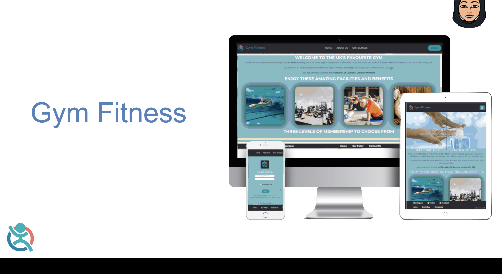

# HI 👋

### 🎓 Software Engineering Nanodegree Final Project - FilmNow

- Built a full stack web application - Film recommendation App - used technologies such as Python, SQL, and JavaScript and implementing python flask and using http methods to process data.
- Lead the team by being Scrum Master through out the buidling phase and created interactive sessions to aid to the technical growth of the team. 
- Achieved Distinction Grade - 86%. 
- Built further leadership, collaboration, communication, organisation and technical skills. 

 

### 🎒 SKY Software Academy Final Project - PureFitness

<centre>  
<centre/>
 

- [Click here to view project code](https://github.com/asiasharif/pure_fitness_web_app)

 

- Built a full-stack fitness web application as part of a group project - implementing various technologies and working in an agile methodology.
- Experienced Scrum Master – front end stage and database stage – guided the team to build a quote generator, by sending front end development resources prior the meeting, creating interactive sessions and enabled us to use JS, Node.js, HTML and CSS. 
- Also, during the building database stage, due to my advanced knowledge in Python and SQL, and we built a great database implementing foreign keys, store procedures and many other functions & developed leadership skills through handling conflict resolution efficiently within the team.
- Certification received.
- Enhanced communication, technical, leadership and collaboration skills. 

 

### ⛓ Blockchain Exercises

- Developed smart contracts using Soldidity programming langauge.
- Strengthened knowledge in solidity and javascript.
- Pair programmed with members in ConsenSys blockchain bootcamp and passed these specific exercises at high level.

- 💻 [Supply Chain Exercise](https://github.com/asiasharif/supply-chain-exercise-asiasharif)

- 💻 [Simple Bank Exercise](https://github.com/asiasharif/simple-bank-exercise-asiasharif)

